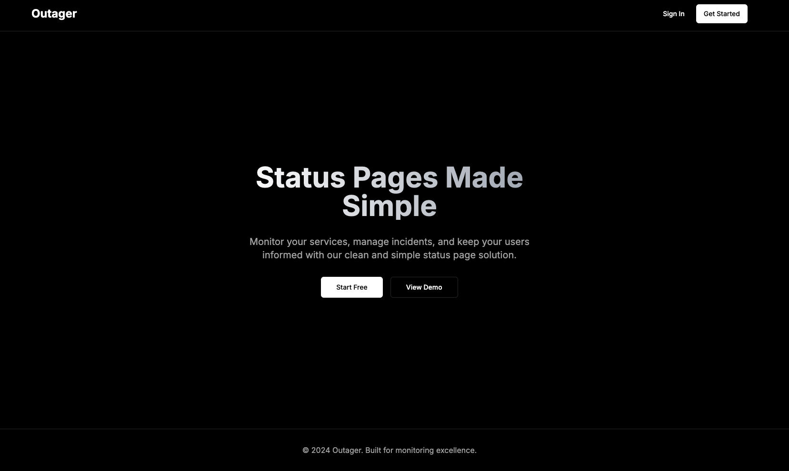
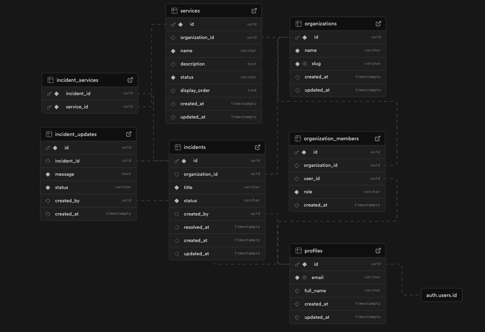

# Outager - Status Page Monitor

A modern, real-time status page application that helps organizations manage services, track incidents, and keep users informed about system status.



## 🌟 Overview

Outager is a comprehensive status page solution similar to StatusPage, Cachet, or Betterstack. It provides organizations with the tools to monitor services, manage incidents, and communicate system status to their users in real-time.

### Key Highlights

- **Real-time Updates** - WebSocket-powered live status updates
- **Multi-tenant Architecture** - Support for multiple organizations
- **Role-based Access Control** - Admin, Member, and Viewer roles
- **Beautiful UI** - Clean, modern interface built with shadcn/ui
- **Public Status Pages** - Shareable status pages for end users

## ✨ Features

### 🔐 Authentication & Team Management

- User registration and authentication via Supabase Auth
- Organization creation and management
- Team member invitations with role-based permissions
- Profile management

### 🛠️ Service Management

- Create and manage services (Website, API, Database, etc.)
- Real-time status updates (Operational, Degraded, Partial Outage, Major Outage)
- Service descriptions and categorization
- Bulk status management

### 🚨 Incident Management

- Create incident reports with detailed descriptions
- Multi-status incident tracking (Investigating, Identified, Monitoring, Resolved)
- Incident updates and timeline
- Associate incidents with affected services
- Real-time incident notifications

### 📊 Public Status Pages

- Clean, branded status pages for each organization
- Real-time status updates via WebSocket
- Incident history and timelines
- Mobile-responsive design
- SEO-friendly URLs (`yourcompany.outager.com`)

### 🔄 Real-time Features

- WebSocket connections for live updates
- Instant service status changes
- Live incident updates
- Real-time team notifications

## 🏗️ Database Design



### Core Tables

```sql
-- Organizations (Multi-tenant support)
organizations
├── id (UUID, Primary Key)
├── name (VARCHAR)
├── slug (VARCHAR, Unique)
├── created_at (TIMESTAMP)
└── updated_at (TIMESTAMP)

-- User Profiles (Extends Supabase Auth)
profiles
├── id (UUID, FK to auth.users)
├── email (VARCHAR, Unique)
├── full_name (VARCHAR)
├── created_at (TIMESTAMP)
└── updated_at (TIMESTAMP)

-- Organization Members (Role-based Access)
organization_members
├── id (UUID, Primary Key)
├── organization_id (UUID, FK)
├── user_id (UUID, FK)
├── role (ENUM: admin, member, viewer)
└── created_at (TIMESTAMP)

-- Services
services
├── id (UUID, Primary Key)
├── organization_id (UUID, FK)
├── name (VARCHAR)
├── description (TEXT)
├── status (ENUM: operational, degraded, partial_outage, major_outage)
├── display_order (INTEGER)
├── created_at (TIMESTAMP)
└── updated_at (TIMESTAMP)

-- Incidents
incidents
├── id (UUID, Primary Key)
├── organization_id (UUID, FK)
├── title (VARCHAR)
├── status (ENUM: investigating, identified, monitoring, resolved)
├── created_by (UUID, FK)
├── resolved_at (TIMESTAMP)
├── created_at (TIMESTAMP)
└── updated_at (TIMESTAMP)

-- Incident Updates
incident_updates
├── id (UUID, Primary Key)
├── incident_id (UUID, FK)
├── message (TEXT)
├── status (VARCHAR)
├── created_by (UUID, FK)
└── created_at (TIMESTAMP)

-- Incident-Service Relations
incident_services
├── incident_id (UUID, FK)
└── service_id (UUID, FK)
```

## 🔧 Tech Stack

### Frontend

- **Framework**: Next.js 15.1.8 (React 18.3.1)
- **Styling**: Tailwind CSS 3.4.1 + shadcn/ui components
- **State Management**: Zustand 5.0.5
- **Forms**: React Hook Form 7.56.4 + Zod 3.25.28
- **Real-time**: Socket.IO Client 4.7.4
- **Icons**: Lucide React 0.511.0

### Backend

- **Runtime**: Node.js
- **Framework**: Express.js 5.1.0
- **Database**: PostgreSQL (Supabase)
- **Authentication**: Supabase Auth
- **Real-time**: Socket.IO 4.7.4
- **Security**: CORS, JWT validation

### Database & Infrastructure

- **Database**: Supabase (PostgreSQL)
- **Authentication**: Supabase Auth
- **Real-time**: WebSocket (Socket.IO)
- **Deployment**: Vercel (Frontend) + Railway/Heroku (Backend)

## 🚀 Installation & Setup

### Prerequisites

- Node.js 18+
- npm or yarn
- Supabase account
- Git

### 1. Clone the Repository

```bash
git clone https://github.com/yourusername/outager.git
cd outager
```

### 2. Backend Setup

```bash
cd backend
npm install
```

#### Install Backend Dependencies

```bash
npm install express@5.1.0 cors@2.8.5 dotenv@16.5.0 @supabase/supabase-js@2.49.8 socket.io@4.7.4 jsonwebtoken@9.0.2 bcryptjs@3.0.2
npm install --save-dev nodemon@3.1.10
```

#### Environment Variables

Create `.env` file in `/backend`:

```env
# Supabase Configuration
SUPABASE_URL=your_supabase_project_url
SUPABASE_ANON_KEY=your_supabase_anon_key
SUPABASE_SERVICE_KEY=your_supabase_service_role_key

# Server Configuration
PORT=8080
FRONTEND_URL=http://localhost:3000

# JWT (if using custom auth)
JWT_SECRET=your_jwt_secret_key
```

#### Database Setup

1. Create a new Supabase project
2. Run the SQL commands from `/backend/src/database/schema.sql`
3. Run the RLS policies from `/backend/src/database/rls_policies.sql`
4. Set up the profile trigger from `/backend/src/database/profile_trigger.sql`

#### Start Backend Server

```bash
npm run dev
# Server runs on http://localhost:8080
```

### 3. Frontend Setup

```bash
cd frontend
npm install
```

#### Install Frontend Dependencies

```bash
npm install next@15.1.8 react@18.3.1 react-dom@18.3.1 tailwindcss@3.4.1 @radix-ui/react-dialog@1.1.14 @radix-ui/react-dropdown-menu@2.1.15 @radix-ui/react-select@2.2.5 @radix-ui/react-tabs@1.1.12 @radix-ui/react-toast@1.2.14 @radix-ui/react-avatar@1.1.10 @radix-ui/react-checkbox@1.3.2 @radix-ui/react-label@2.1.7 @radix-ui/react-separator@1.1.7 @radix-ui/react-slot@1.2.3 class-variance-authority@0.7.1 clsx@2.1.1 lucide-react@0.511.0 react-hook-form@7.56.4 socket.io-client@4.7.4 tailwind-merge@3.3.0 tailwindcss-animate@1.0.7 zod@3.25.28 zustand@5.0.5 @hookform/resolvers@5.0.1 date-fns@4.1.0
npm install --save-dev postcss@8
```

#### Environment Variables

Create `.env.local` file in `/frontend`:

```env
# API Configuration
NEXT_PUBLIC_API_URL=http://localhost:8080/api
NEXT_PUBLIC_WEBSOCKET_URL=http://localhost:8080

# Supabase (for client-side auth)
NEXT_PUBLIC_SUPABASE_URL=your_supabase_project_url
NEXT_PUBLIC_SUPABASE_ANON_KEY=your_supabase_anon_key
```

#### Start Frontend Server

```bash
npm run dev
# Application runs on http://localhost:3000
```

### 4. Project Structure

```
outager/
├── backend/
│   ├── src/
│   │   ├── config/
│   │   │   └── supabase.js
│   │   ├── database/
│   │   │   ├── schema.sql
│   │   │   ├── rls_policies.sql
│   │   │   └── profile_trigger.sql
│   │   ├── middleware/
│   │   │   └── auth.js
│   │   ├── routes/
│   │   │   ├── auth.js
│   │   │   ├── organizations.js
│   │   │   ├── services.js
│   │   │   ├── incidents.js
│   │   │   └── teams.js
│   │   ├── websocket.js
│   │   └── server.js
│   ├── package.json
│   └── .env
├── frontend/
│   ├── app/
│   │   ├── dashboard/
│   │   │   ├── incidents/
│   │   │   ├── services/
│   │   │   ├── settings/
│   │   │   └── layout.js
│   │   ├── signin/
│   │   ├── signup/
│   │   ├── demo/
│   │   ├── [slug]/
│   │   ├── layout.js
│   │   └── page.js
│   ├── components/
│   │   └── ui/
│   ├── lib/
│   │   ├── api.js
│   │   ├── utils.js
│   │   └── websocket.js
│   ├── store/
│   │   └── auth-store.js
│   ├── package.json
│   └── .env.local
└── README.md
```

## 🔄 User Flows

### 1. Organization Setup Flow

```
Sign Up → Create Organization → Invite Team Members → Add Services → Monitor Status
```

### 2. Service Management Flow

```
Dashboard → Services → Add Service → Update Status → Real-time Updates
```

### 3. Incident Management Flow

```
Dashboard → Incidents → Report Incident → Add Updates → Resolve Incident
```

### 4. Public Status Page Flow

```
Public URL → View Service Status → Check Incidents → Subscribe to Updates
```

## 🎯 Core Architecture

### Backend Architecture

- **Express.js API** with RESTful endpoints
- **Supabase Integration** for database and authentication
- **WebSocket Server** for real-time communications
- **Role-based Middleware** for access control
- **Error Handling** and logging

### Frontend Architecture

- **Next.js App Router** for routing and SSR
- **Zustand Store** for state management
- **React Hook Form** for form handling
- **shadcn/ui Components** for consistent UI
- **WebSocket Client** for real-time updates

## 🔒 Security Features

- JWT-based authentication via Supabase
- Row Level Security (RLS) policies
- Role-based access control
- CORS protection
- Input validation and sanitization
- Secure environment variable handling

## 🚢 Deployment

### Frontend (Vercel)

1. Connect your GitHub repository to Vercel
2. Set environment variables in Vercel dashboard
3. Deploy automatically on push to main branch

### Backend (Railway/Heroku)

1. Create new project on Railway or Heroku
2. Connect GitHub repository
3. Set environment variables
4. Deploy with automatic scaling

### Database (Supabase)

- Managed PostgreSQL database
- Automatic backups and scaling
- Built-in authentication system

## 🧪 Demo

Visit the live demo: [https://outager-demo.vercel.app/demo](https://outager-demo.vercel.app/demo)

**Demo Credentials:**

- Email: demo@outager.com
- Password: demo123

## 📝 API Documentation

### Authentication Endpoints

- `POST /api/auth/signup` - User registration
- `POST /api/auth/signin` - User login
- `GET /api/auth/me` - Get current user

### Organization Endpoints

- `POST /api/organizations` - Create organization
- `GET /api/organizations/my-organizations` - Get user's organizations
- `GET /api/organizations/slug/:slug` - Get organization by slug

### Service Endpoints

- `GET /api/services/organization/:id` - Get organization services
- `POST /api/services/:organizationId` - Create service
- `PATCH /api/services/:serviceId/status` - Update service status
- `DELETE /api/services/:serviceId` - Delete service

### Incident Endpoints

- `GET /api/incidents/organization/:id` - Get organization incidents
- `POST /api/incidents/:organizationId` - Create incident
- `POST /api/incidents/:orgId/:incidentId/updates` - Add incident update

### Team Endpoints

- `GET /api/teams/:organizationId/members` - Get team members
- `POST /api/teams/:organizationId/members` - Add team member
- `PATCH /api/teams/:orgId/members/:memberId` - Update member role
- `DELETE /api/teams/:orgId/members/:memberId` - Remove team member

## 🤝 Contributing

1. Fork the repository
2. Create your feature branch (`git checkout -b feature/amazing-feature`)
3. Commit your changes (`git commit -m 'Add some amazing feature'`)
4. Push to the branch (`git push origin feature/amazing-feature`)
5. Open a Pull Request

## 📄 License

This project is licensed under the MIT License - see the [LICENSE](LICENSE) file for details.

## 🙏 Acknowledgments

- [Supabase](https://supabase.com) for backend infrastructure
- [shadcn/ui](https://ui.shadcn.com) for beautiful UI components
- [Vercel](https://vercel.com) for frontend hosting
- [Tailwind CSS](https://tailwindcss.com) for styling
- [Next.js](https://nextjs.org) for the React framework

---

**Built with ❤️ by Hrishikesh Patil**
